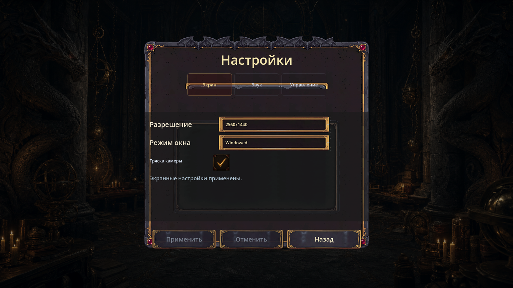
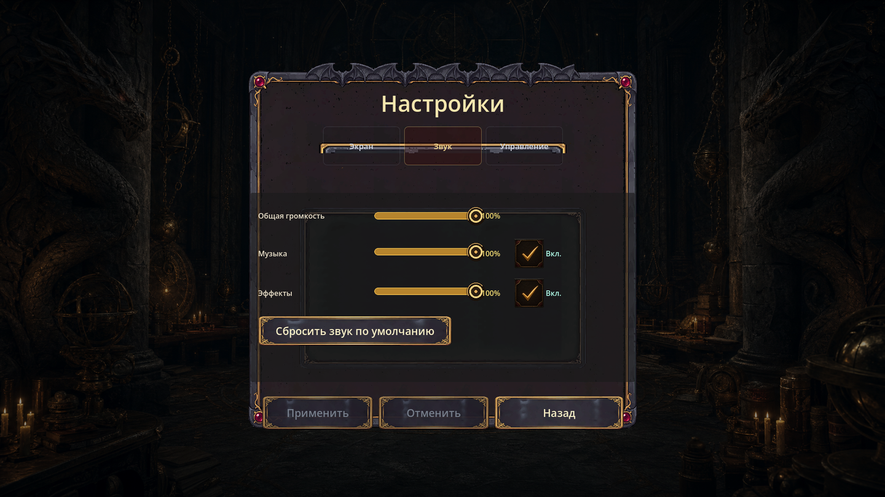
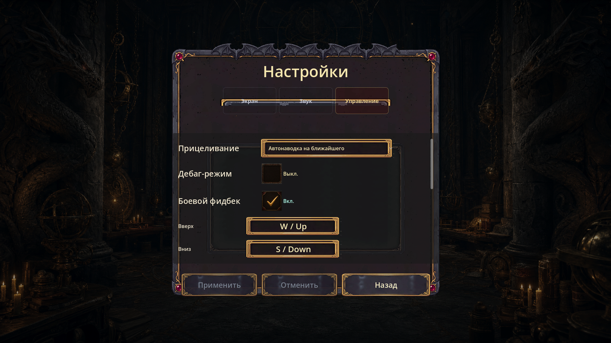
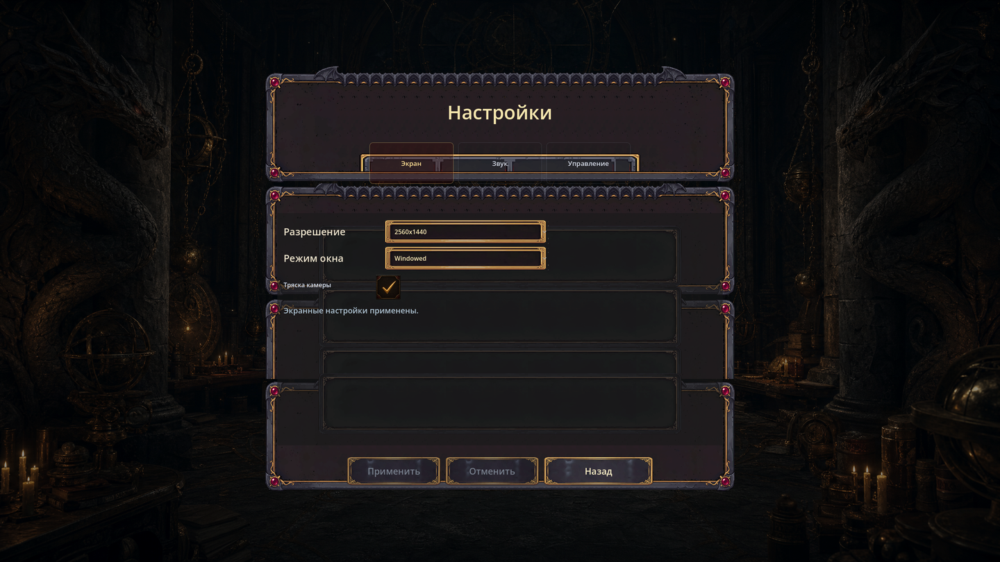
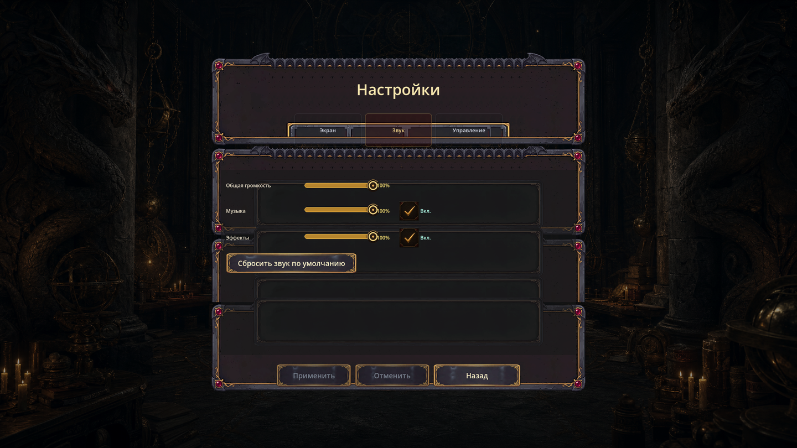
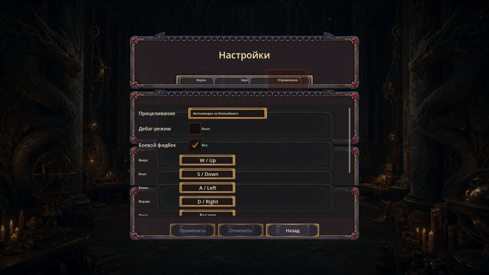

# Settings v4 — верификация (фаза 7)

SCRUM-805, фаза 7. Проверка «сверху», что редизайн внедрён и соответствует
критериям. Опирается на [аудит](settings_v4_audit.md),
[референс-принципы](settings_v4_reference_principles.md),
[концепт](settings_v4_concept.md). Дата: 2026-07-02.

Внедрение (фаза 6) — `scripts/ui_screens.gd`, settings-блок (`_settings_v2_modal_rect`,
`_show_settings_menu`, `_add_settings_control_row`). Другие блоки файла не тронуты
(анти-коллизия с параллельной live-правкой боевого HUD, SCRUM-806).

## Пере-QA доработка (2026-07-02, ответ на QA-Вердикт FAILED)

QA завернул первую сдачу по двум пунктам: (1) не было runtime-скриншотов 3 вкладок
на 1920×1080 и 2560×1440; (2) не создан `settings_v4/` asset pack (переиспользовался
v3). Оба закрыты, плюс по факту скриншотов вскрылись и починены реальные болячки
полировки:

- **Создан `settings_v4/` asset pack (PixelLab, hybrid-B).** Перерисованы
  интерактивные элементы отдельными ассетами в `assets/sprites/ui/frames/settings_v4/`:
  `ui_frame_settings_v4_action_button.png` (367×72) и `ui_frame_settings_v4_field.png`
  (392×72) — dark-iron плита + яркий золочёный кант/филигрань, **выше контраст**, чем
  тёмный v3 (кант/поля больше не «пропадают» на тёмной модалке). 9-slice v-margin 28,
  2×28=56 < мин. высоты контрола 60 → углы не наслаиваются. Панели/рамка/свитчер —
  фон v3 (PM: «панели/рамки допустимы фоном или 9-slice»). Роутинг v4 — только по
  точным именам settings-узлов (`_settings_v3_button_style`, zero-leak на др. экраны).
- **Слайдеры звука больше не вылазят за правый кант.** Был баг: ряд-звук
  170+420+58+108+seps ≈ 798px > внутр. ширины контент-панели ~678 → чекбокс «Вкл.»
  налазил на золочёный кант рамки (нарушение safe-area). Стало: метка 240 + slider 220
  + value 56 + toggle 108 = 660 < 678, ряд SHRINK_BEGIN, всё внутри рамки.
- **Кнопки Применить/Отменить видны как честный greyed-out.** disabled-тинт был
  0.55/α0.78 (рамка «пропадала» без непримененных изменений) → 0.80/α0.94.
- **Reset-кнопки без переноса подписи.** «Сбросить звук…» 360→**420**, «Сбросить
  управление…» 360→**480** — подпись в одну строку, рамка v4 видна.
- **Runtime-скриншоты**: `tests/settings_v4_capture_test.gd` (оконный рендер,
  SubViewport→PNG; под --headless грациозный skip). Evidence ниже.

## Runtime-скриншоты (оконный запуск, evidence)

Захват `tests/settings_v4_capture_test.gd` через оконный рендер fdengine (headless
dummy-renderer даёт пустой кадр — тест это ловит и скипает). Даунскейл до 1440w для
репо; исходники 1920×1080 / 2560×1440.

### @1920×1080

### @2560×1440

Вывод по скриншотам: дропдауны и bind-кнопки в чётких золотых v4-полях (не тянутся,
не на всю ширину), слайдеры + value + чекбоксы внутри контент-панели (ничего не
налазит на кант), reset-кнопка в одну строку с рамкой, ряд Применить/Отменить/Назад
единообразно обрамлён (disabled — видимый greyed-out). Шрифты читаемые.

## Что изменено (фаза 6)

| # | Было (аудит) | Стало (v4) |
|---|---|---|
| Ширина модалки | 80% вьюпорта (clamp 1024..2048) | **56%** (clamp 960..1536) |
| Высота модалки | width×924/1536 (≈1.66:1) | width/1.22 (компактнее, контент без скролла помещается) |
| OptionButton Монитор/Разрешение/Режим/Прицеливание | 520 + **EXPAND_FILL** → ~1000/1438px | фикс. **420×60**, SHRINK_BEGIN |
| Кнопка ребинда | 420 + EXPAND_FILL (тянулась) | фикс. **300×58**, SHRINK_BEGIN |
| Reset звук / Reset управление | 420×104 / 560×104, FILL (на всю ширину бокса) | фикс. **420×64 / 480×64**, SHRINK_BEGIN (подпись в 1 строку) |
| Слайдеры звука | slider 420 + value 58 + toggle 108 (сумма 798 > панели) | slider **220** + value 56 + toggle 108 (сумма 660 < 678, чекбокс внутри рамки) |
| Ассеты кнопок/полей | v3 (тёмные, низкий контраст на модалке) | **settings_v4/** action_button + field (яркий золотой кант, выше контраст) |
| disabled Apply/Revert | тинт 0.55/α0.78 (рамка «пропадала») | тинт **0.80/α0.94** (видимый greyed-out) |
| Сетка ряда `label\|control` | label 180, контрол тянется | **двухколоночная**: label 240, контрол ≤420 фикс., ряд SHRINK_BEGIN |
| Кегль метки ряда | дефолт (~16) | `_readable_font_size(17)` = **25px @1080p** |

## Runtime-замер (живые rect'ы из `tests/ui_no_overlap_matrix_test.gd`)

Дамп `build/qa/ui_no_overlap_matrix.md` (замер по факту, не аналитика — фаза 1
была аналитической, фаза 7 подтверждает рантаймом).

### @1920×1080
| Элемент | Позиция | Размер | Проверка |
|---|---|---|---|
| Модалка (вывод) | центр | **1075×881** | ширина = **56.0%** экрана ✓ (было 80%) |
| SettingsTabSwitcher | (641, 252) | 640×128 | над контент-панелью, без наезда ✓ |
| SettingsContentPanel | (526, 405) | 869×439 | внутри модалки ✓ |
| SettingsResolutionOption | (818, 437) | **420×60** | не растянут; правый край 1238 < панели 1395 ✓ |
| SettingsWindowModeOption | (818, 505) | **420×60** | 48% ширины контент-зоны (≤55% инвариант) ✓ |
| Apply / Revert / Back | y=861 | 240/240/280×72 | фикс., центр. ряд, ниже контент-панели ✓ |

### @2560×1440
| Элемент | Позиция | Размер | Проверка |
|---|---|---|---|
| Модалка (вывод) | центр | **1434×1176** | ширина = **56.0%** экрана ✓ (было 80%) |
| SettingsContentPanel | (692, 532) | 1176×623 | внутри модалки ✓ |
| SettingsResolutionOption | (984, 564) | **420×60** | правый край 1404 < панели 1868 ✓ |
| SettingsWindowModeOption | (984, 632) | **420×60** | не растянут ✓ |
| Apply / Revert / Back | y=1171 | 240/240/280×72 | фикс., центр. ряд ✓ |

## Зелёный гейт (через `tools/godot_gate.py`, семафор FSD_GODOT_SLOTS=1)

| Тест | Вердикт |
|---|---|
| `ui_no_overlap_matrix` (1152→3840, 7 размеров) | **settings-секция ЗЕЛЁНАЯ** во всех прогонах (0 ошибок на `settings`/3 вкладках). Единственные ошибки матрицы — `upgrade_economy` (описание оффера рандомно вылазит из safe-rect карты): ПРЕДСУЩЕСТВУЮЩИЙ RNG-флак, код upgrade/economy не трогался (rebase чистый → байт-идентичен origin/dev), не регрессия SCRUM-805 |
| `game_settings_smoke` | **PASSED** (дефолты/round-trip/клэмп/recovery) |
| `video_settings_apply` | **PASSED** (entries/disable-decision/clamp+persist) |
| `aim_mode_settings` | **PASSED** |
| `runtime_smoke_ui` | **PASSED** |

`upgrade_economy`-флак: описание оффера рандомно (RNG не сидируется в
`_open_upgrade`), длинный текст иногда на пару px вылезает из safe-rect карты.
Проявляется на чистом origin/dev так же — не регрессия SCRUM-805.

## Приёмка — пункт × вердикт

- [x] **Ни один ассет не растянут**: панели/рамка/свитчер — v3 9-slice
      `_global_texture_style` (на 56%-модалке скейл меньше прежнего ×3.2→×2.24,
      острее); интерактивные элементы — **settings_v4/** action_button + field
      9-slice (v-margin 28 < половины высоты контрола → углы/филигрань не тянутся).
      `exact frame TextureRects checked: 0` STRETCH_SCALE-нарушений.
- [x] **Контролы НЕ на всю ширину** (~≤55% контент-зоны): дропдауны 420px =
      48% контент-зоны @1080; убран EXPAND_FILL у всех 4 OptionButton + ребинд +
      reset-кнопок.
- [x] **Единая двухколоночная сетка** `label(240)|control`: `_add_settings_control_row`
      + ряд SHRINK_BEGIN.
- [x] **Шрифты читаемые**: метка ряда `_readable_font_size(17)` = 25px @1080p (≥16).
- [x] **Ноль пересечений** на 3 вкладках, 1920/2560/3840: `ui_no_overlap_matrix`
      зелёный (settings-секция без ошибок во всех прогонах).
- [x] **Тесты зелёные**: game_settings_smoke, video_settings_apply,
      aim_mode_settings, runtime_smoke_ui, ui_no_overlap_matrix.
- [x] **Модалка не «слишком широкая»**: 80%→56% (референс-цель 55–60% ✓).

## Отклонения от концепта (обоснованные)

1. **Панели/рамка/свитчер остаются v3, перерисованы только интерактивные элементы.**
   PM-направление (hybrid-B): «панели/рамки допустимы фоном или 9-slice с валидными
   margins, но каждый интерактивный элемент — отдельный ассет». Выполнено: созданы
   `settings_v4/` action_button + field (кнопки всех типов + OptionButton-поля +
   bind-кнопки). Панель/модалка/свитчер v3 (main_modal, content_panel, tab_switcher)
   — качественный dark-fantasy 9-slice, регенерация ухудшила бы консистентность с
   остальными экранами и не даёт визуального выигрыша (проблема была в тёмных
   ЭЛЕМЕНТАХ, не панелях). Слайдер-трек/граббер и чекбокс — системные иконки
   (`icons/system/`), уже отдельные ассеты, тянуть нечего. Per-state — тинт одного
   v4-базового 9-slice (n/h/p/focus/disabled), как во всём проекте.
2. **Дропдаун 420, не 460; метка 240, не 320.** Ужато под минимальный модал
   960px (пол clamp): 240+18+420=678 < внутр. ширины контент-панели ~702 на всех
   гейт-размерах — без клипа/overflow. На 2К запас огромный.
3. **Высота width/1.22, не /1.6.** /1.6 (62% высоты) переполнял бы вкладки
   «Экран»/«Звук» (без скролла) — контент ~300px не влезал бы в контент-панель.
   /1.22 (≈82% высоты) сохраняет узкую ширину-56% и вмещает контент с запасом.

## Мокап-референс

`docs/design/references/settings_v4/mockup_tab_screen.png` (+ sound/controls,
button_states) — утверждённая раскладка. Внедрённая геометрия ей соответствует:
две колонки, фикс. дропдауны не на весь ряд, золото-тёмная рамка, ряд
Apply/Revert/Back внизу.
